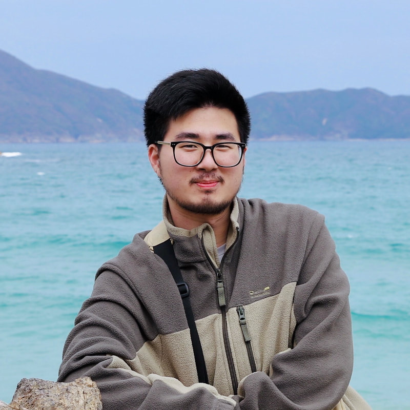

<table border="0">
  <tr>
    <td width="75%">
      <h1>Tianran Zhang</h1>
      
<b>Ph.D candidate</b>

      
<b>The University of Hong Kong</b>

      
<b>Email: zhangtr@connect.hku.hk</b>

      
<b>Address: Room 401, Hui Oi Chow Science Building, The University of Hong Kong, Pok Fu Lam Road, Hong Kong</b>

    </td>
    <td width="25%">
      
    </td>
  </tr>
</table>

---

### Other websites
[LinkedIn](https://hk.linkedin.com/in/tianran-zhang-b6348b169/en), [Google Scholar](https://scholar.google.com/citations?user=yVpiCaMAAAAJ), [GitHub](https://github.com/zhangtianran), [zhihu](https://www.zhihu.com/people/cang-ran-lao-zei-zhang-tian-shi), [Bilibili](https://space.bilibili.com/5134338?spm_id_from=333.337.0.0)

### Personal introduction
I am currently pursuing Ph.D in Prof. [Yufeng Wang's group](https://wanglab.hku.hk/) in HKU. My research covers on the synthesis of colloids and the colloidal assemblies, ranging from patchy colloids to active colloids. I employed techniques, including dispersed polymerisation, wetting-dewetting strategy, to create colloids with anisotropic patches or stimuli-responsiveness. I also investigated the self- and directed assembly of colloids into complex structure and patterns with tuneable interaction.

I also upload some videos about travel or my cats on [Bilibili](https://space.bilibili.com/5134338?spm_id_from=333.337.0.0) as my hobbies.

### Research Direction
- **Synthesis of novel colloids**
- **Colloidal assembly**

### Honors
- **Postgraduate Student Award**
- **Lee Shau Kee Postgraduate Fellowship**
- **Silver Award in BIOMOD Biomolecular Design Competition**

### Research Projects
#### The University of Hong Kong（2019.9~present）
- **Chiral assembly of colloidal particles**  
I synthesized Janus MOF particles and assemble them into chiral clusters.
- **Dynamic assembly of active colloids**  
I synthesized novel active colloids for dynamic assembly.

#### Jilin University（2015.9~2019.7）
- **BIOMOD Biomolecular Design Competition**  
This competition is held at University of California, San Francisco. We use DNA origami to make a nanocage for encapsulation of TMV protein. We won silver award. 
- **Final year project**  
I synthesized porous materials for purification of pollutant in water.
